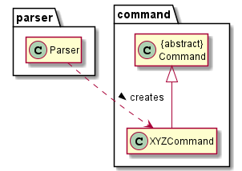

# Developer Guide

## Design

### Architecture

The **Architecture Design** given above explains the high-level design of the App.
Given below is a quick overview of each component.  

`Modman` is the main class of the application, and handles the app launch,
initializing the appropriate classes to be used.  

The rest of the app consists of IDKHOWMANY components:

*
*
*

The sections below give more details of each component.

## Logic Component (Jianning)

1. The `Parser` class is used to parse the user command.
2. This returns a `Command` object which is executed in `Modman`.
3. The command execution can affect the state of other components e.g. the sort command changes the order of assignments in `Module`.
4. The `Command` object can also instruct the `Ui` to list and display information to the user.

Given below is the Sequence Diagram for creating the corresponding `Command` object from user input via `Parser`.  
The sequence diagram also acts as a reference frame for `getCommand`.

## Assignment Component

## Implementation

### Sorting Assignments by Deadline (Jianning)

Given below is an example usage scenario and how the sorting mechanism behaves.

Step 1. The user launches the application. The CS2113T module has an assignment quiz1 due on 17 Aug 2021.
Step 2. The user adds 2 more assignments quiz2 and quiz3
Step 3. The user only sets the deadline for quiz3 to be 16 Aug 2021.
Step 4. The user executes `sort by deadline` which reorders the assignments in CS2113T to be quiz3, quiz1 and quiz2.
Assignments with null as deadline are sorted behind assignments with deadlines.

### [Coming Soon] Autograding (Jianning)

## Product scope
### Target user profile

{Describe the target user profile}

### Value proposition

{Describe the value proposition: what problem does it solve?}

## User Stories

|Version| As a ... | I want to ... | So that I can ...|
|--------|----------|---------------|------------------|
|v1.0|new user|see usage instructions|refer to them when I forget how to use the application|
|v2.0|user|find a to-do item by name|locate a to-do without having to go through the entire list|

## Non-Functional Requirements

{Give non-functional requirements}

## Glossary

* *glossary item* - Definition

## Instructions for manual testing

{Give instructions on how to do a manual product testing e.g., how to load sample data to be used for testing}
