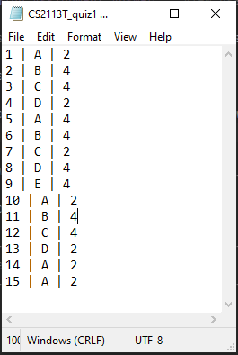
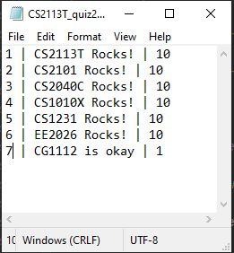
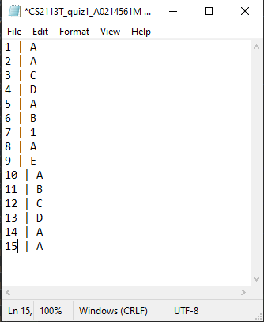
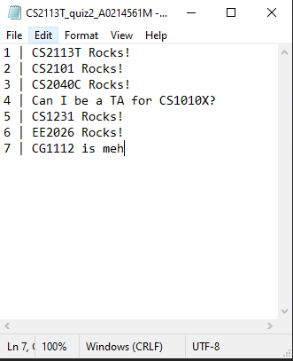
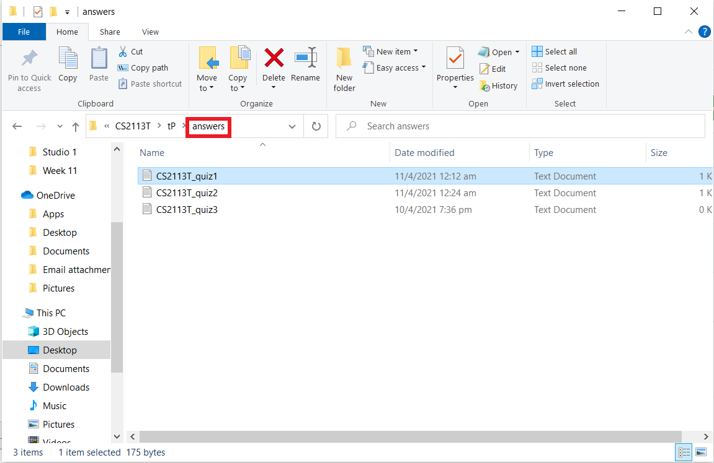
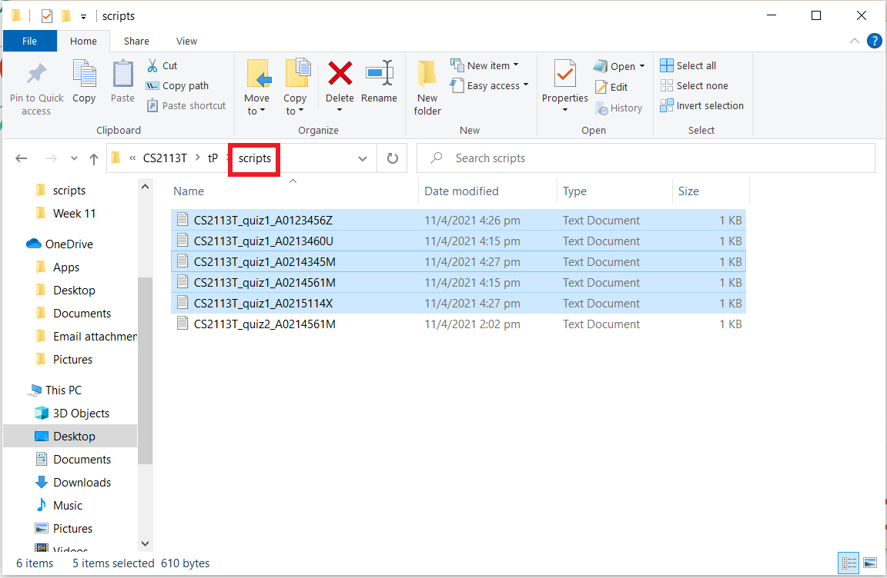

# ModMan User Guide

<hr style="border:2px solid orange; background-color: orange"> </hr>

## Introduction
````
 __  __           _   __  __ 
|  \/  |         | | |  \/  |
| \  / | ___   __| | | \  / | __ _ _ __
| |\/| |/ _ \ / _  | | |\/| |/ _  |  _ \
| |  | | (_) | (_| | | |  | | (_| | | | |
|_|  |_|\___/ \__'_| |_|  |_|\__'_|_| |_|
````
ModMan, short for Module Manager, is a desktop app designed to help Teaching Assistants (TAs) manage their module(s).
It is optimized for use via a Command Line Interface (CLI). ModMan helps to track module details as well as students’ progress and data, all in one platform. It can also perform autograding for MCQ assignments.

### What is a CLI?
A command line interface (CLI) is a text-based user interface used to view and manage computer files.

These include operating system CLIs like the Command Prompt on Windows, which can be used to run and interact with the ModMan application.

<hr style="border:2px solid orange; background-color: orange"> </hr>

## How to use the User Guide
Welcome to the User Guide for ModMan!

Regardless if you are a teaching assistant, student or lecturer, this guide would be helpful for you in picking up and using ModMan.

* You may navigate to any subsection from the [Table of contents](#table-of-contents).
* Scroll down or click [here](#1-quick-start) for the Quick Start guide to get started now.
* [FAQ](#3-faq) and [Command Summary](#4-command-summary) are available for quick queries or reference.

<div style="page-break-after: always;"></div>

### Legend
A short description of the icons that are used in this User Guide.

Icon | Purpose
------ | ----------------
| :information_source: | Explainers on how to use and interpret the User Guide |
| :warning: | Warnings on usage of ModMan |
| :bulb: | Tips for Teaching Assistants |

<div style="page-break-after: always;"></div>

## Table of contents
1. [Quick start](#1-quick-start) <br>
    1.1 [Input Formatting](#11-input-formatting)<br>
    1.2 [Database File Tampering](#12-database-file-tampering)<br>
1. [Features](#2-features) <br>
   2.1 [Module](#21-module) <br>
   &nbsp;&nbsp;&nbsp;&nbsp; 2.1.1 [`add module` - Adding a Module](#211-adding-a-module-add-module) <br>
   &nbsp;&nbsp;&nbsp;&nbsp; 2.1.2 [`remove module` - Removing a Module](#212-removing-a-module-remove-module) <br>
   &nbsp;&nbsp;&nbsp;&nbsp; 2.1.3 [`select` - Selecting a Module](#213-selecting-a-module-select) <br>
   &nbsp;&nbsp;&nbsp;&nbsp; 2.1.4 [`current` - Viewing Current Module](#214-viewing-current-module-current) <br>
   &nbsp;&nbsp;&nbsp;&nbsp; 2.1.5 [`list module` - Listing Modules](#215-listing-modules-list-module) <br>
   2.2 [Student](#22-student) <br>
   &nbsp;&nbsp;&nbsp;&nbsp; 2.2.1 [`add student` - Adding a Student](#221-adding-a-student-add-student) <br>
   &nbsp;&nbsp;&nbsp;&nbsp; 2.2.2 [`list student details` - Listing Students Details](#222-listing-students-details-list-student-details) <br>
   &nbsp;&nbsp;&nbsp;&nbsp; 2.2.3 [`list student` - Listing Students in Module](#223-listing-students-in-module-list-student) <br>
   2.3 [Timetable](#23-timetable) <br>
   &nbsp;&nbsp;&nbsp;&nbsp; 2.3.1 [`add timetable` - Adding a Lesson](#231-adding-a-lesson-add-timetable) <br>
   &nbsp;&nbsp;&nbsp;&nbsp; 2.3.2 [`delete timetable` - Removing Timetable Lessons](#232-removing-timetable-lessons-delete-timetable) <br>
   &nbsp;&nbsp;&nbsp;&nbsp; 2.3.3 [`edit timetable` - Editing a Timetable Lesson](#233-editing-timetable-lessons-edit-timetable) <br>
   &nbsp;&nbsp;&nbsp;&nbsp; 2.3.4 [`list timetable` - Listing Timetable Lessons](#234-listing-timetable-lessons-list-timetable) <br>
   2.4 [Assignment](#24-assignment) <br>
   &nbsp;&nbsp;&nbsp;&nbsp; 2.4.1 [`add assignment` - Adding an Assignment](#241-adding-an-assignment-add-assignment) <br>
   &nbsp;&nbsp;&nbsp;&nbsp; 2.4.2 [`set assignment deadline` - Setting Assignment Deadline](#242-setting-assignment-deadline--set-assignment-deadline) <br>
   &nbsp;&nbsp;&nbsp;&nbsp; 2.4.3 [`set assignment grade` - Setting Assignment Grade](#243-setting-assignment-grade--set-assignment-grade) <br>
   &nbsp;&nbsp;&nbsp;&nbsp; 2.4.4 [`set assignment percentage` - Setting Assignment Percentage of Overall Grade](#244-setting-assignment-percentage-set-assignment-percentage) <br>
   &nbsp;&nbsp;&nbsp;&nbsp; 2.4.5 [`set assignment comments` - Setting Assignment Comments](#245-setting-assignment-comments-set-assignment-comments) <br>
   &nbsp;&nbsp;&nbsp;&nbsp; 2.4.6 [`get assignment comments` - Getting Assignment Percentage](#246-getting-assignment-comments-get-assignment-comments) <br>
   &nbsp;&nbsp;&nbsp;&nbsp; 2.4.7 [`edit assignment name` - Editing an Assignment Name](#247-editing-an-assignment-name-edit-assignment-name) <br>
   &nbsp;&nbsp;&nbsp;&nbsp; 2.4.8 [`list assignments` - Listing Module Assignments](#248-listing-module-assignments--list-assignments) <br>
   &nbsp;&nbsp;&nbsp;&nbsp; 2.4.9 [`sort assignments by deadline` - Sorting Module Assignments](#249-sorting-module-assignments--sort-assignments-by-deadline) <br>
   &nbsp;&nbsp;&nbsp;&nbsp; 2.4.10 [`list assignment grades` - Listing Assignment Grades](#2410-listing-assignment-grades--list-assignment-grades) <br>
   &nbsp;&nbsp;&nbsp;&nbsp; 2.4.11 [`view assignment answer` - Viewing Assignment Answers](#2411-viewing-assignment-answer--view-assignment-answer) <br>
   &nbsp;&nbsp;&nbsp;&nbsp; 2.4.12 [`view student script` - Viewing Student Script](#2412-viewing-student-script--view-student-script) <br>
   &nbsp;&nbsp;&nbsp;&nbsp; 2.4.13 [`autograde assignment` - Auto-Grading Assignments](#2413-autograding-assignments--autograde-assignment) <br>
   2.5 [Help and Exit](#25-help-and-exit) <br>
   &nbsp;&nbsp;&nbsp;&nbsp; 2.5.1 [`help` - Listing Basic Commands](#251-listing-basic-commands-help) <br>
   &nbsp;&nbsp;&nbsp;&nbsp; 2.5.2 [`bye` - Exiting ModMan](#252-exiting-modman--bye) <br>
1. [FAQ](#3-faq)
1. [Command summary](#4-command-summary)

<div style="page-break-after: always;"></div>

## 1. Quick Start

1. Ensure you have Java 11 installed on your computer or install it from [here](https://www.oracle.com/sg/java/technologies/javase-jdk11-downloads.html).
1. Download the latest `ModMan.jar` release from [here](https://github.com/AY2021S2-CS2113T-F08-1/tp/releases/tag/v2.0).
1. Open a command window in the folder containing the `.jar` file.
1. Run the command `java -jar {filename}.jar` <br> If you haven't changed the filename, run the command `java -jar ModMan.jar`

<hr style="border:1px solid darkorange; background-color: darkorange"> </hr>

### 1.1 Input Formatting
This section covers points to note about proper input formats for commands.

1. Commands that do not accept any parameters (`help`, `current` etc.) will display wrong command error if any parameters are entered.
2. For commands with flags (ie. `/t`, `/s`):
    * All flags must be entered completely in the order specified in command format.
    * There is one whitespace before and after each flag eg. `/t<space>TYPE<space>/v<space>...`; Input would be truncated if spaces are not present.</br>
        * `/t<space>/v...`: One space between flags, second flag would not be recognised.
        * `/t<space><space>/v...`: Two spaces between flags, input for flag `/t` would be parsed as empty.
        * `.../s 1600/e 1800`: `START_TIME` will be parsed as `160`.
    * Any inputs within the space between the flags would be trimmed for whitespaces.
        * `/t<space><space>Lecture<space><space><space>/v ...`: Input for `/t` will be trimmed to `Lecture`.
    
| :warning: | Inputs that do not follow this format would be invalid. |
|----------------------|-------------------------------------|

<hr style="border:1px solid darkorange; background-color: darkorange"> </hr>

### 1.2 Database File Tampering

This section provides a warning for the handling of database for ModMan. 

| :warning: | The database of ModMan is stored in the `Database.txt` file. **You should not tamper with the file**.<br>If you delete or edit the contents of the `Database.txt` file such that there are duplicate `Module`, `Student`,`Lesson` or `Assignment` or introduce any invalid attributes or formatting, the data will likely be corrupted.<br>In such cases, the program will create a new database upon starting. |
|----------------------|-------------------------------------|

If you delete the whole `Database.txt`, a new `Database.txt` would be created for you.

Although not recommended, edits may be made in `Database.txt` that effects changes in ModMan while still loading those changes in when starting up.
* For example, changing student name of `Student` to another name that does not match any other `Student`.

<div style="page-break-after: always;"></div>

## 2. Features 

| :information_source: | Inputs in `UPPER_CASE` are parameters to be supplied by the user. |
|----------------------|-------------------------------------|


### 2.1 Module

<hr style="border:1px solid darkorange; background-color: darkorange"> </hr>

### 2.1.1 Adding a Module: `add module`

Adds a new module to the list of modules. If you are a TA for multiple modules, you can keep track of all of them!

Format: `add module MODULE_NAME`

Example of usage:

`add module CS2113T`

Expected output:

```` 
--------------------------------------------------------------------------
    I have added a new module: CS2113T
-------------------------------------------------------------------------- 
````


| :warning: | Input is case sensitive, ie. `CS2113T` and `cs2113T` would be considered two different modules |
|----------------------|-------------------------------------|

<hr style="border:0.5px solid darkorange; background-color: darkorange"> </hr>

### 2.1.2 Removing a Module: `remove module`

Removes a module from the list of modules.

Format: `remove module MODULE_NAME`

Example of usage:

`remove module CS2113T`

Expected output:

```` 
--------------------------------------------------------------------------
    You have successfully removed module: CS2113T
-------------------------------------------------------------------------- 
````

| :warning: | You can remove the current `Module` you are working in |
|----------------------|-------------------------------------|

<hr style="border:0.5px solid darkorange; background-color: darkorange"> </hr>

### 2.1.3 Selecting a Module: `select`

Select the module you want to currently work in.

Format: `select MODULE_NAME`

Example of usage:

`select CS2113T`

Expected output:

```` 
--------------------------------------------------------------------------
    Success! You are now working in: CS2113T
-------------------------------------------------------------------------- 
````


| :information_source: | All commands onwards assumes we are working in the module CS2113T |
|----------------------|-------------------------------------|

<hr style="border:0.5px solid darkorange; background-color: darkorange"> </hr>

### 2.1.4 Viewing Current Module: `current`

View the current module you are working in. Also obtain an overview of the module, namely the lessons, assignments, as well as number of students.

Format: `current`

Expected output:

```` 
--------------------------------------------------------------------------
    You are currently working in: CS2113T

	Here's an overview of CS2113T
	    - You have not added any lessons yet.

	    - You currently have 0 students in your class

	    - You have not added any assignments to yet.
-------------------------------------------------------------------------- 
````

<hr style="border:0.5px solid darkorange; background-color: darkorange"> </hr>

### 2.1.5 Listing Modules: `list module`

Lists all the modules you have added, and specifies the current module (if any).

Format: `list module`

Expected output:

```` 
--------------------------------------------------------------------------
    Here are your modules: 
	1. CS2113T (current)
-------------------------------------------------------------------------- 
````

<div style="page-break-after: always;"></div>

### 2.2 Student 

<hr style="border:1px solid darkorange; background-color: darkorange"> </hr>

### 2.2.1 Adding a student: `add student`

Assigns a new student to the current module you have selected.

Format: `add student /s STUDENT_NAME /# STUDENT_NUMBER /e STUDENT_EMAIL`

| :warning: | Students with matching `STUDENT_NAME`, `STUDENT_NUMBER` or `STUDENT_EMAIL` cannot be assigned to the same module. |
|----------------------|-------------------------------------|

Example of usage:

`add student /s Bryan Wong /# A0123456Y /e e0123456@u.nus.edu`

Expected output:
```
---------------------------------------------------------------------
    I have assigned a new student to CS2113T:
    Bryan Wong, A0123456Y, e0123456@u.nus.edu
---------------------------------------------------------------------
```

<hr style="border:0.5px solid darkorange; background-color: darkorange"> </hr>

### 2.2.2 Listing Students Details: `list student details`

Lists the details of all students assigned to the current module you have selected.

Format: `list student details`

Expected output:

```` 
--------------------------------------------------------------------------
    Here are the students of all students enrolled in CS2113T:
    1. Bryan Wong, A0123456Y, e0123456@u.nus.edu
-------------------------------------------------------------------------- 
````

<hr style="border:0.5px solid darkorange; background-color: darkorange"> </hr>

### 2.2.3 Listing Students in Module: `list student`

Lists the names of students assigned to the current module you have selected. 
This is slightly different from the `list student details` command, allowing you to view just the names of the students assigned to a module.

Format: `list student`

Expected output:
```
---------------------------------------------------------------------
    Here are the students in CS2113T:
    1. Bryan
---------------------------------------------------------------------
```

<div style="page-break-after: always;"></div>

### 2.3 Timetable

<hr style="border:1px solid darkorange; background-color: darkorange"> </hr>

### 2.3.1 Adding a Lesson: `add timetable`

Adds a new lesson to the list (timetable) of lessons for the current module you have selected. You will be able
to specify the type of lesson, venue, day and timing.

Format: `add timetable /t TYPE /v VENUE /d DAY /s START_TIME /e END_TIME`

* The `TYPE` and `VENUE` can be in a natural language format.
* The `DAY` must be a valid day spelt out fully in caps eg. `MONDAY`.  
* The `START_TIME` and `END_TIME` must be in the format `HHmm` eg. `1800`.
* `START_TIME` must be before `END_TIME`.
* The parameters cannot be empty or whitespaces.
* Input `2400` for `START_TIME` and `END_TIME` would be interpreted as `00:00`.

| :warning: | `Lesson` with the exact same parameters as an existing `Lesson` cannot be added |
|----------------------|-------------------------------------|

Example of usage:

`add timetable /t Lecture /v Zoom /d FRIDAY /s 1600 /e 1800`

Expected output:
```
---------------------------------------------------------------------
    Success! I have added the following timetable for the module - CS2113T
    Lecture: FRIDAY, 16:00-18:00 (Zoom)
---------------------------------------------------------------------
```

In the above example, the user has added a CS2113T Lecture that will occur on Friday from 4pm to 6pm over Zoom. Notice that
you have to be careful in specifying the `Day` and 24-hr timing format.

<hr style="border:0.5px solid darkorange; background-color: darkorange"> </hr>

### 2.3.2 Removing Timetable Lessons: `delete timetable`

Deletes the lesson in the timetable corresponding to the index, for the current module you have selected.

Format: `delete timetable LESSON_INDEX`

Example usage:

`delete timetable 1`

Expected output:
```
---------------------------------------------------------------------
    You have successfully removed lesson: FRIDAY, 16:00-18:00 from CS2113T
---------------------------------------------------------------------
```

<hr style="border:0.5px solid darkorange; background-color: darkorange"> </hr>

### 2.3.3 Editing Timetable Lessons: `edit timetable`

Edits the lesson in the timetable corresponding to the index, for the current module you have selected.

Format: `edit timetable LESSON_INDEX /t TYPE /v VENUE /d DAY /s START_TIME /e END_TIME`

* You may enter `-` for the field(s) you do not wish to change.
* The `TYPE` and `VENUE` can be in a natural language format.
* The `DAY` must be a valid day spelt out fully in caps eg. `MONDAY`.
* The `START_TIME` and `END_TIME` must be in the format `HHmm` eg. `1800` if specified.
* `START_TIME` must be before `END_TIME`.
* The parameters cannot be empty or whitespaces.
* Input `2400` for `START_TIME` and `END_TIME` would be interpreted as `00:00`.

| :warning: | Edited `Lesson` cannot have the exact same parameters as an existing `Lesson` |
|----------------------|-------------------------------------|

Example of usage:

Changing the day to Monday: `edit timetable 1 /t - /v - /d MONDAY /s - /e -`

Expected output:
```
---------------------------------------------------------------------
    You have successfully edited the lesson to:
    Lecture: MONDAY, 16:00-18:00 (Zoom)
---------------------------------------------------------------------
```

In the example we have used till now, we had added a CS2113T Lecture that will occur on Friday from 4pm to 6pm over Zoom. 
The above command can be used to change the day from `FRIDAY` to `MONDAY`.

<hr style="border:0.5px solid darkorange; background-color: darkorange"> </hr>

### 2.3.4 Listing Timetable Lessons: `list timetable`

Lists the lessons in the timetable for the current module you have selected. The index of each lesson is its numerical order in the list. 

Format: `list timetable`

* The `START_TIME` and `END_TIME` will be listed in the format `HH:mm` eg. `18:00`.

Expected output:
```
---------------------------------------------------------------------
    Here are the lessons in CS2113T:
    1. Lecture: FRIDAY, 16:00-18:00 (Zoom)
---------------------------------------------------------------------
```

<div style="page-break-after: always;"></div>

### 2.4 Assignment

<hr style="border:1px solid darkorange; background-color: darkorange"> </hr>

### 2.4.1 Adding an Assignment: `add assignment`

Adds an assignment to the current module you have selected.

:warning: The parameter /t allows for only 3 types of assignment: "la" (which stands for Long Assignments), "sa" (which stands for Short Assignments) and "mcq" (which stands for Multiple Choice Question Assignments).

Format: `add assignment /t TYPE_OF_ASSIGNMENT /a ASSIGNMENT_NAME`

Examples of usage:
* `add assignment /t mcq /a Magic Sequence`
* `add assignment /t la /a recursion`

Expected output:

```
---------------------------------------------------------------------
    I have added a new assignment to CS2113T:
    Magic Sequence
---------------------------------------------------------------------
```

<hr style="border:0.5px solid darkorange; background-color: darkorange"> </hr>

### 2.4.2 Setting Assignment Deadline : `set assignment deadline`

The `set assigment deadline` command allows you to set the date to grade the assignment by.
If a deadline had been set previously, the deadline of the assignment will be updated.

Format: `set assignment deadline /a ASSIGNMENT_NAME /d DEADLINE`

| :warning: | The deadline must be in the format `dd MM yyyy` e.g. 16 08 2021. <br> You are also restricted to dates between year 2021 and 2030 </br> |
|----------------------|-------------------------------------|


The deadline has to follow a strict format to allow you to easily sort your assignments by deadline later on!

Examples of usage:</br>

1. `set assignment deadline /a quiz1 /d 16 08 2021`

```
---------------------------------------------------------------------
    I have set quiz1's deadline to Aug 16 2021 in CS2113T
---------------------------------------------------------------------
```
2. `set assignment deadline /a quiz2 /d 17 08 1999`

```
---------------------------------------------------------------------
    OOPS!!! Date/Time Format is wrong!
    Please re-enter the Date/Time in the following format: dd MM yyyy
    Note that only year 2021 to 2030 is accepted.
---------------------------------------------------------------------
```

| :bulb: | You can set your own deadlines to be earlier than the actual deadline for grading to help plan your time more wisely!|
|----------------------|-------------------------------------|

<hr style="border:0.5px solid darkorange; background-color: darkorange"> </hr>

### 2.4.3 Setting Assignment Grade : `set assignment grade`

The `set assigment grade` command allows you to set the grade of a student after you have graded their assignment.
If a grade had been set previously, the grade for the student will be updated.

Format: `set assignment grade /a ASSIGNMENT_NAME /s STUDENT_NAME /g GRADE`

| :warning: | The grade must be a percentage within the range 0 to 100. <br> It can also be a decimal number.</br>|
|----------------------|-------------------------------------|


Examples of usage:</br>

1. `set assignment grade /a quiz1 /s Jianning /g 100`

```
---------------------------------------------------------------------
    I have set Jianning's grade to 100 for assignment quiz1 in CS2113T
---------------------------------------------------------------------
```
2. `set assignment grade /a quiz1 /s Jianning /g 101

```
---------------------------------------------------------------------
    OOPS!!! The percentage you entered is invalid! Please provide a percentage value between 0 to 100
---------------------------------------------------------------------
```

| :bulb: | You can manually set the grades of your students if you prefer a more personal touch compared to autograding|
|----------------------|-------------------------------------|

<hr style="border:0.5px solid darkorange; background-color: darkorange"> </hr>

### 2.4.4 Setting Assignment Percentage: `set assignment percentage` 

Sets the assignment weightage of an existing assignment. The percentage can be entered as either a 2-decimal number, 1-decimal number or an integer. 

Format: `set assignment percentage /a ASSIGNMENT_NAME /p PERCENTAGE` 

Examples of usage:
* `set assignment percentage /a Magic Sequence /p 15` 
* `set assignment percentage /a Forest Fruits /p 25.0` 

Expected output:

```
---------------------------------------------------------------------
    I have set Magic Sequence's percentage to 15.0 in CS2113T
---------------------------------------------------------------------
```

<hr style="border:0.5px solid darkorange; background-color: darkorange"> </hr>

### 2.4.5 Setting Assignment Comments: `set assignment comments` 
 
Sets a comment for an existing assignment. The assignment comment cannot exceed 100 characters. ModMan will eventually support comments of unlimited length (we are still working on this feature!). 
 
| :bulb: |The editing an assignment's comment feature is still in production. However, you can recreate an edit by calling the [`get assignment comments`](#246-getting-assignment-comments-get-assignment-comments) command, copy-pasting the result onto your terminal and editing before setting assignment comments again| 
|----------------------|-------------------------------------| 
 
Format: `set assignment comments /a ASSIGNMENT_NAME /c COMMENTS` 

Examples of usage:
* `set assignment comments /a Magic Sequence /c This assignment is well done.`
* `set assignment comments /a Forest Fruits /c Most people did not solve this assignment in full.`

Expected output:

```
---------------------------------------------------------------------
    I have added a comment to Magic Sequence:
        This assignment is well done.
---------------------------------------------------------------------
```

<hr style="border:0.5px solid darkorange; background-color: darkorange"> </hr>

### 2.4.6 Getting Assignment Comments: `get assignment comments`

Retrieves the assignment comments of an existing assignment and prints it out for the user.

Format: `get assignment comments /a ASSIGNMENT_NAME`

Example of usage:

`get assignment comments /a Magic Sequence`

Expected output:

```
---------------------------------------------------------------------
    Your previous comments for Magic Sequence are as follows:
        1. This assignment is well done.
---------------------------------------------------------------------
```

<hr style="border:0.5px solid darkorange; background-color: darkorange"> </hr>

### 2.4.7 Editing an Assignment Name: `edit assignment name`

Edits the assignment name of an existing assignment

Format: `edit assignment name /a OLD_ASSIGNMENT_NAME /n NEW_ASSIGNMENT_NAME`

Examples of usage:
* `edit assignment name /a Magic Sequence /n Forest Fruits`
* `edit assignment name /a recursion /n iteration`

Expected output:

```
---------------------------------------------------------------------
    I have updated your assignment name:
    Forest Fruits
---------------------------------------------------------------------
```

<hr style="border:0.5px solid darkorange; background-color: darkorange"> </hr>

### 2.4.8 Listing Module Assignments : `list assignments` 

The `list assignments` command lists out all the assignments in the current module you are working in. It also shows you information on the type of assignment 
and the due date for grading, if you have set a deadline for the assignment.

If you have executed the `sort assignments by deadline` command, the assignments will be listed in order from the most to least urgent.
Otherwise, the assignments will be listed in the order it was added. (more details on sorting assignments will be provided in section 2.4.9 `sort assignments by deadline`)

Format: `list assignments` 

Example of usage:</br> 
Let's say you have added 3 assignments to the module CS2113T and set the deadline for the first two quizzes. 
Executing the `list assignments` command will show you an expected output as shown below.

Expected output:
```
---------------------------------------------------------------------
    Here are the assignments in CS2113T:
    1. quiz1 (McqAssignment) due by: Aug 17 2021
    2. quiz2 (ShortAnswerAssignment) due by: Aug 16 2021
    3. quiz3 (LongAnswerAssignment) - due date not specified.
---------------------------------------------------------------------
```

| :information_source: | Assignments with no deadline set will output `due date not specified` |
|----------------------|-------------------------------------|

<hr style="border:0.5px solid darkorange; background-color: darkorange"> </hr>

### 2.4.9 Sorting Module Assignments : `sort assignments by deadline` 

The `sort assignment by deadline` command sorts and lists the assignments in your current module by deadline, allowing you to easily keep track of which assignments have to be graded soon. 
The assignments are sorted based on the urgency of the grading from the most urgent to the least urgent. </br>

Here are some special cases to consider when sorting assignments: 
* If an assignment does not have a deadline, it will be sorted after other assignments with valid deadlines. 
* If two assignments have the same deadline or both do not have a deadline set, they will retain the initial order of when they were added to the module. 

| :bulb: | You can set your own deadlines to be earlier than the actual deadline for grading to help plan your time more wisely!|
|----------------------|-------------------------------------|

Format: `sort assignments by deadline`

Here is an example of the order of assignments before and after sorting:

Before sorting:
```
---------------------------------------------------------------------
    Here are the assignments in CS2113T:
    1. quiz1 (McqAssignment) - due date not specified.
    2. quiz2 (ShortAnswerAssignment) due by: Aug 17 2021
    3. quiz3 (LongAnswerAssignment) due by: Aug 16 2021
---------------------------------------------------------------------
```

After sorting:
```
---------------------------------------------------------------------
    Here are the assignments in CS2113T:
    1. quiz3 (LongAnswerAssignment) due by: Aug 16 2021
    2. quiz2 (ShortAnswerAssignment) due by: Aug 17 2021
    3. quiz1 (McqAssignment) - due date not specified.
---------------------------------------------------------------------
```

<hr style="border:0.5px solid darkorange; background-color: darkorange"> </hr>

### 2.4.10 Listing Assignment Grades : `list assignment grades` 

Lists the students' grades for a particular assignment.

Format: `list assignment grades /a ASSIGNMENT_NAME`

Examples of usage:
* `list assignment grades /a quiz1`
* `list assignment grades /a quiz3`

Expected output:
```
---------------------------------------------------------------------
    Here are the students' grades for the quiz1 assignment:
    1. A0214561M - 100.0
    2. A0215114X - 101.0
---------------------------------------------------------------------
```

<hr style="border:0.5px solid darkorange; background-color: darkorange"> </hr>

### 2.4.11 Viewing Assignment Answer : `view assignment answer`

The `view assignment answer` command allows you to easily search and retrieve the answer key for an assignment just by entering the name of the assignment. </br>

Answers are stored as text files in the `answers` folder which can be found in the same working directory as the ModMan app.</br> 

| :information_source: | Naming of the answer text file has to be in the format `<ModuleCode>_<AssignmentName>.txt` for our system to be able to automatically retrieve the answers for you  |
|----------------------|-------------------------------------|

Within the text file, the answer for each question should also follow the format `<QUESTION_NUMBER> | <ANSWER> | <MARKS>` whereby: </br>
* The first column contains the question number</br>
* The second column contains the answer for the corresponding question</br> 
* The third column contains the marks for getting that question correct</br> 

Shown below are examples of what the answer text file for an assignment should look like:</br> 
On the left, we have the answer key for an MCQ assignment quiz1.</br> 
On the right, we have the answer key for a Short Answer assignment quiz2. 

&nbsp;&nbsp;&nbsp;&nbsp;&nbsp;&nbsp;&nbsp; &nbsp;&nbsp;&nbsp;&nbsp;&nbsp;&nbsp;&nbsp;&nbsp;&nbsp;&nbsp;&nbsp;&nbsp;&nbsp;&nbsp;&nbsp;&nbsp;&nbsp;&nbsp;&nbsp;&nbsp;&nbsp;&nbsp;&nbsp;&nbsp;&nbsp;&nbsp;&nbsp;&nbsp;&nbsp; 

:warning: Here are some things to look out for when editing the answer text file:
* Question numbers should be in sequential order starting from 1
* Answers for MCQ assignments should only include options A to E or 1 to 5
* Answers for Short Answer and Long Answer assignments should not exceed 100 characters long
* Marks should have non-negative integer values 
* Ensure that the delimiter `|` is not used in the answer 


Format: `view assignment answer /a ASSIGNMENT_NAME`

Example of usage:</br>
Let's say you want to view the answer key to quiz1 shown above on the left.</br> 
The command `view assignment answer /a quiz1` quickly searches through the `answers` folder to display the answer key in the format `<QUESTION_NUMBER>. <ANSWER> | [<MARKS>]`.</br> 
The expected output below shows what it would look like in the app. 

Expected output: 
```
---------------------------------------------------------------------
    Answer key for quiz1:
    1. A | [2] 
    2. B | [4] 
    3. C | [4] 
    4. D | [2] 
    5. A | [4] 
    6. B | [4] 
    7. C | [2] 
    8. D | [4] 
    9. E | [4] 
    10. A | [2] 
    11. B | [4] 
    12. C | [4] 
    13. D | [2] 
    14. A | [2] 
    15. A | [2] 
---------------------------------------------------------------------
```
| :bulb: | You can open up the student script in another terminal so that you can view both the answer key and student script side by side! |
|----------------------|-------------------------------------|

<hr style="border:0.5px solid darkorange; background-color: darkorange"> </hr>

### 2.4.12 Viewing Student Script : `view student script`

The `view student script` command allows you to easily search and retrieve the student's script for an assignment just by entering the name of the assignment and the student.</br> 

Scripts are stored as text files in the `scripts` folder which can be found in the same working directory as the ModMan app.</br>  

| :information_source: | Naming of the script text file has to be in the format `<ModuleCode>_<AssignmentName>_<MatricNumber>\.txt` for our system to be able to automatically retrieve the script for you  |
|----------------------|-------------------------------------|

Within the text file, the answer for each question should also follow the format `<QUESTION_NUMBER> | <ANSWER>` whereby:</br> 
* The first column contains the question number</br>
* The second column contains the student's answer for the corresponding question</br> 

Shown below are examples of what a student's script text file for an assignment should look like:</br> 
On the left, we have the script for an MCQ assignment quiz1.</br> 
On the right, we have the script for a Short Answer assignment quiz2. 

&nbsp;&nbsp;&nbsp;&nbsp;&nbsp;&nbsp;&nbsp; &nbsp;&nbsp;&nbsp;&nbsp;&nbsp;&nbsp;&nbsp;&nbsp;&nbsp;&nbsp;&nbsp;&nbsp;&nbsp;&nbsp;&nbsp;&nbsp;&nbsp;&nbsp;&nbsp;&nbsp;&nbsp;&nbsp;&nbsp;&nbsp;&nbsp;&nbsp;&nbsp;&nbsp;&nbsp; 

:warning: Here are some things to look out for when formatting the script text file: 
* Question numbers should be in sequential order starting from 1 
* Answers for all assignment types should not exceed 100 characters long 
* Ensure that the delimiter `|` is not used in the answer 


Format: `view student script /a ASSIGNMENT_NAME /s STUDENT_NAME` 

Example of usage:</br> 
Let's say you want to view your student Jianning's script for quiz1.</br> 
The command `view student script /a Jianning` quickly searches through the `scripts` folder by matching the student name with their matric number.</br>
The script is then displayed in the format `<QUESTION_NUMBER>. <ANSWER>` for each question in the assignment.</br>
The expected output below shows what it would look like in the app.</br>
Expected output:
```
---------------------------------------------------------------------
    Jianning(A0214561M)'s script for quiz1 
    1. A 
    2. A 
    3. C 
    4. D 
    5. A 
    6. B 
    7. 1 
    8. A 
    9. E 
    10. A 
    11. B 
    12. C 
    13. D 
    14. A 
---------------------------------------------------------------------
```
| :bulb: | You can open up the answer key in another terminal so that you can view both the answer key and student script side by side!|
|----------------------|-------------------------------------|

<hr style="border:0.5px solid darkorange; background-color: darkorange"> </hr>

### 2.4.13 Autograding Assignments : `autograde assignment`

ModMan has an integrated autograder to help you grade digital assignment submissions easily and efficiently!</br> 

The key features of autograding are as follows:</br>

* All the students' scripts for that assignment found in the `scripts` folder will be graded. 
* The grades for each student will be listed out for you and automatically saved in the database. 
* Keeps track of which of your students have not submitted their work.

| :warning: | Currently, only MCQ and Short Answer assignments can be autograded | 
|----------------------|-------------------------------------|

Format: `autograde assignment /a ASSIGNMENT_NAME` 

Example of usage: 

Let's say you are currently teaching 10 students in CS2113T and the deadline for students to submit their quiz1 MCQ assignment was yesterday.
The following 3 steps are all you need to autograde all your students'assignments:

1. Copy and Paste the answer key for quiz1 into the `answers` folder found in the same working directory as the ModMan app. 



2. Copy and Paste the students' scripts for quiz1 into the `scripts` folder found in the same working directory as the ModMan app. 



3. Execute the command `autograde assignment /a quiz1` 

Expected output:
```
---------------------------------------------------------------------
    Here are the students' grades for the quiz1 assignment: 
    1. A0214561M - 78.26087 
    2. A0215114X - 100.0 
    3. A0213460U - 78.26087 
    4. A0123456Z - 86.95652 
    5. A0214345M - 82.608696 
    These are the students who have not submitted their assignments: 
    1. Naughty, A1111111A, e1111111@u.nus.edu 
    2. Mischievous, A2222222A, e2222222@u.nus.edu 
    3. Playful, A3333333A, e3333333@u.nus.edu 
    4. Tardy, A4444444A, e4444444@u.nus.edu 
    5. Bad Boy, A5555555A, e5555555@u.nus.edu 
---------------------------------------------------------------------
```

| :information_source: | Answers for MCQ assignments are limited to the options A to E or 1 to 5</br>Answers fpr Short Answer Assignments are limited to 100 characters.|
|----------------------|-------------------------------------|

<div style="page-break-after: always;"></div>

### 2.5 Help and Exit

<hr style="border:1px solid darkorange; background-color: darkorange"> </hr>

### 2.5.1 Listing Basic Commands: `help`

This command is available for you to get a quick reference of all the basic commands available in ModMan, and their usages.
You can invoke `help` any time you are unsure of the basic commands and their formats.

Format: `help`

Expected output:

```` 
--------------------------------------------------------------------------
    Here are the list of basic commands you can use:
 
	1. Adding a Module: add module MODULE_NAME
	2. Selecting a Module: select MODULE_NAME
	3. Viewing Current Module: current
	4. Adding a student: add student /s STUDENT_NAME /# STUDENT_NUMBER /e STUDENT_EMAIL
	5. Adding a Lesson: add timetable /t TYPE /v VENUE /d DAY /s START_TIME /e END_TIME
	6. Adding an Assignment: add assignment /t TYPE_OF_ASSIGNMENT /a ASSIGNMENT_NAME
	7. Setting Assignment Deadline: set assignment deadline /a ASSIGNMENT_NAME /d DEADLINE
	8. Auto-Grading Assignments: autograde /a ASSIGNMENT_NAME
	9. Setting Assignment Comments: set assignment comments /a ASSIGNMENT_NAME /c COMMENT
	10. Exiting ModMan: bye

    For the full list of commands, check out the User Guide at: https://ay2021s2-cs2113t-f08-1.github.io/tp/UserGuide.html

-------------------------------------------------------------------------- 
`````
Please note that it does not display the full list of commands (due to there being so many!).
You may open this User Guide for a comprehensive list.

<hr style="border:0.5px solid darkorange; background-color: darkorange"> </hr>

### 2.5.2 Exiting ModMan : `bye`

Auto-saves all your changes and exits the program. ModMan will have all your data ready the next time you load it.

Format: `bye`

Expected output:
```
---------------------------------------------------------------------
    Bye. Hope to see you again soon!
---------------------------------------------------------------------
```

<hr style="border:2px solid orange; background-color: orange"> </hr>

## 3. FAQ

**Q**: How do I delete a particular student/assignment? 

**A**: The feature of deletion is still in progress and will be released in our upcoming versions. 

**Q**: When is the data saved to the database?

**A**: It is only saved when you exit the program using the `bye` command.

**Q**: How do I add the answer key and students' scripts for grading?

**A**: You can simply copy and paste the answer key and student scripts into the respective folders in the working directory of ModMan named `answers` and `scripts` respectively.

<hr style="border:2px solid orange; background-color: orange"> </hr>

## 4. Command Summary
<br>

**Module Commands:**

| Action | Format, Examples |
------ | ----------------
add module | `add module MODULE_NAME` <br> e.g. `add module CS2113T`
remove module | `remove module MODULE_NAME` <br> e.g. `remove module CS2113T`
select module | `select MODULE_NAME` <br> e.g. `select CS2113T`
view current module | `current` <br>
list module | `list module` <br>

<br>

**Student Commands:**


| Action | Format, Examples |
------ | ----------------
add student | `add student /s STUDENT_NAME /# STUDENT_NUMBER /e STUDENT_EMAIL` <br> e.g. `add student /s John Doe /# A0123456Y /e e0123456@u.nus.edu`
list student details | `list student details` <br>
list student | `list student` <br> 

<br>

**Timetable Commands:**

| Action | Format, Examples |
------ | ----------------
add timetable | `add timetable /t TYPE /v VENUE /d DAY /s START_TIME /e END_TIME` <br> e.g. `add timetable /t Lecture /v Zoom /d FRIDAY /s 1600 /e 1800`
delete timetable | `delete timetable LESSON_INDEX` <br> e.g. `delete timetable 1`
edit timetable | `edit timetable LESSON_INDEX /t TYPE /v VENUE /d DAY /s START_TIME /e END_TIME` <br> e.g. `edit timetable 1 /t - /v COM2 /d - /s 1600 /e 1800`
list timetable | `list timetable` <br> 

<br>

**Assignment Commands:**

| Action | Format, Examples |
------ | ----------------
add assignment | `add assignment /t TYPE_OF_ASSIGNMENT /a ASSIGNMENT_NAME` <br> e.g. `add assignment /t mcq /a Magic Sequence`
set assignment deadline | `set assignment deadline /a ASSIGNMENT_NAME /d DEADLINE` <br> e.g. `set assignment deadline /a quiz1 /d 17 08 2021`
set assignment grade | `set assignment grade /a ASSIGNMENT_NAME /s STUDENT_NAME /g GRADE` <br> e.g. `set assignment grade /a quiz1 /s Jianning /g 100`
set assignment percentage | `set assignment percentage /a ASSIGNMENT_NAME /p PERCENTAGE` <br> e.g. `set assignment percentage /a Magic Sequence /p 15`
set assignment comments | `set assignment comments /a ASSIGNMENT_NAME /c COMMENTS` <br> e.g. `set assignment comments /a Magic Sequence /p This assignment is well done.`
get assignment comments | `get assignment comments /a ASSIGNMENT_NAME` <br> e.g. `get assignment comments /a Magic Sequence`
edit assignment name | `edit assignment name /a OLD_ASSIGNMENT_NAME /n NEW_ASSIGNMENT_NAME` <br> e.g. `edit assignment /t mcq /a Magic Sequence /n Forest Fruits`
list assignments | `list assignments` <br>
sort assignments by deadline | `sort assignments by deadline` <br>
list assignment grades | `list assignment grades /a ASSIGNMENT_NAME` <br> e.g. `list assignment grades /a quiz1`
view assignment answer | `view assignment answer /a ASSIGNMENT_NAME` <br> e.g. `view assignment answer /a quiz1`
view student script | `view student script /a ASSIGNMENT_NAME /s STUDENT_NAME` <br> e.g. `view assignment answer /a quiz1 /s Jianning`
autograde assignment | `autograde assignment /a ASSIGNMENT_NAME` <br> e.g. `autograde assignment /a quiz1`

<br>

**Help and Exit Commands:**


| Action | Format|
------ | ----------------
help | `help` <br>
bye | `bye` <br>